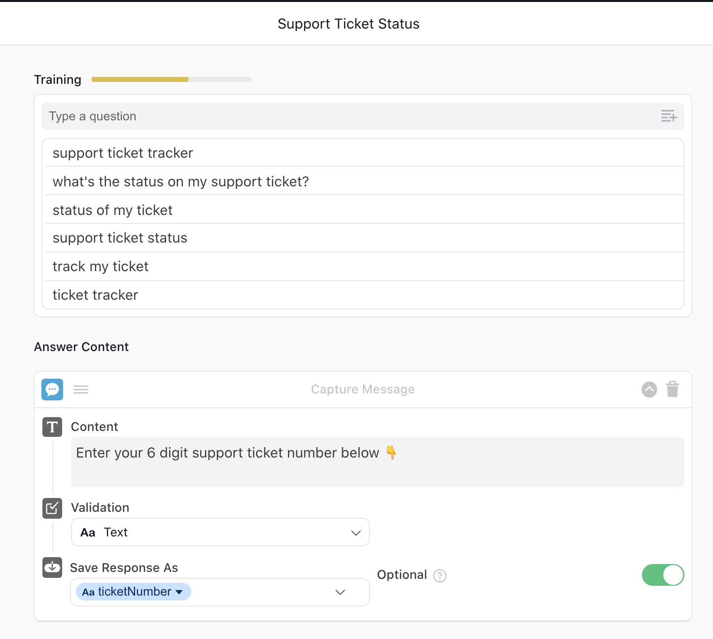

# Support Ticket Status

An Ada App for customers to see the current status of their support tickets and update them if they have additional information.


## Track your ticket status


## Getting Started

### Installation
1. Clone the github respository.
```
git clone https://github.com/tdsimpson/AdaAppHacks.git
```

2. Install the dependencies and run the app
```
yarn install
```

### Running

2. Run the app
```
yarn start
```

3. In another terminal, run ngrok. This will make a public url for your localhost
```
ngrok.exe http 9008 --host-header=localhost
```

4. Copy the URL and paste it in "App URL" through the Ada tool

### NOTE:

Here are 3 sample support ticket numbers you can use when you are prompted for one in the chat.
* 333444
* 555666
* 777888

## Ada Configuration

This is how the App is configured in the bot backend:



